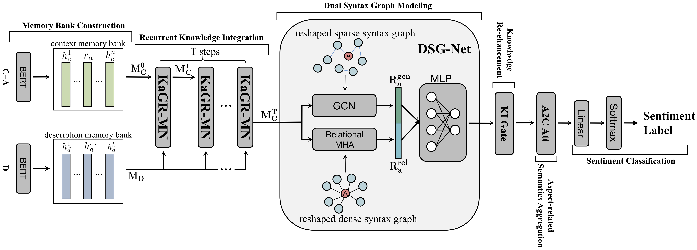
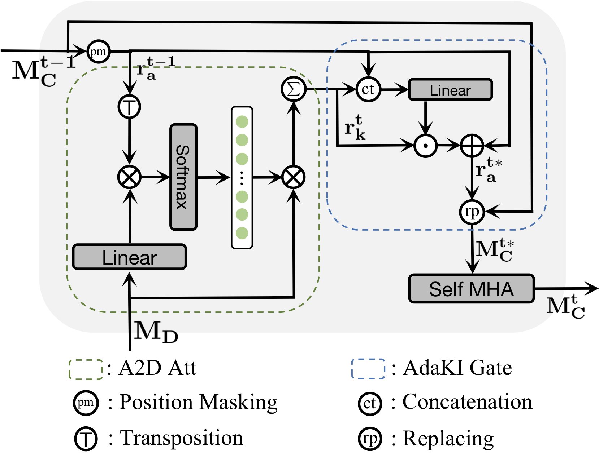

# KaGRMN-DSG_ABSA
This repository contains the PyTorch source Code for our paper: **[Understand me, if you refer to Aspect Knowledge: Knowledge-aware Gated Recurrent Memory Network](https://arxiv.org/abs/2108.02352)**.
Bowen Xing and Ivor Tsang.

***Accepted by IEEE Transactions on Emerging Topics in Computational Intelligence (TETCI)***.

## Architectures

Our framework:



Details of KaGRMN cell:

<div align = center></div>

## Requirements
Our code relies on Python 3.6 and following libraries:
- transformers==1.1.0
- torch==1.2.0
- numpy==1.16.0
- tqdm==4.50.2
- scikit_learn==0.23.2

## Run 
``` shell script
    # Restaurant14
    python run.py --cuda_id 0 --dataset_name rest --seed 2021  --embedding_type bert --self_num_heads 3 --rel_num_heads 4 --dropout 0.3 --bert_lr 5e-5 --learning_rate 1e-5 --weight_decay 0.05 --stack_num 4 --n_gcn 2
  
    # Laptop14
    python run.py --cuda_id 0 --dataset_name laptop --seed 2021  --embedding_type bert --self_num_heads 3 --rel_num_heads 2 --dropout 0.3 --bert_lr 1e-5 --learning_rate 5e-5 --weight_decay 0.001 --stack_num 4 --n_gcn 2

    # Restaurant15
    python run.py --cuda_id 0 --dataset_name res15 --seed 2021 --embedding_type bert --self_num_heads 6 --rel_num_heads 6 --dropout 0.3 --bert_lr 3e-5 --learning_rate 2e-5 --weight_decay 0.05 --stack_num 2 --n_gcn 2 --logging_steps 25

```

## Citation
If the code is used in your research, please star this repo and cite our paper :)
The bibtex of our paper is:
<pre>
@misc{bowen2021KaGRMN,
      title={Understand me, if you refer to Aspect Knowledge: Knowledge-aware Gated Recurrent Memory Network}, 
      author={Bowen Xing and Ivor Tsang},
      year={2021},
      eprint={2108.02352},
      archivePrefix={arXiv},
      primaryClass={cs.CL}
}
</pre>
